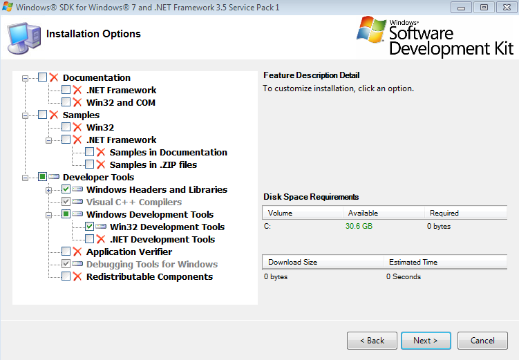
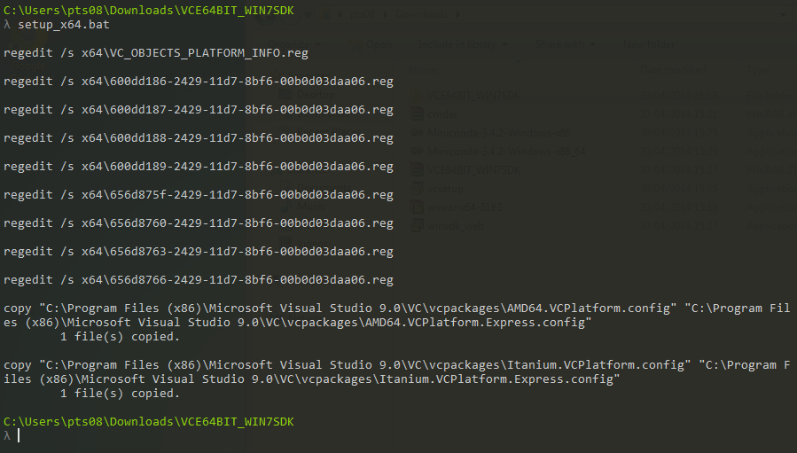

Date: 2014-07-30
Title: Building Python 2.7 extensions on Windows 7 (64 and 32 bit)
Tagline: Setting up Visual Studio 2008 for building Python 2.7 C-extensions on Windows
Slug: python_windows_development
Category: Blog
Tags: Windows, Python, Visual Studio, C
Authors: Patrick Snape

## Why develop on Windows?
The Menpo team is dedicated to providing conda packages for all platforms. By far the biggest hurdle towards this goal was successfully building our package on Windows. There is one major reason for this: **Visual Studio 2008** [^1] [^2]. Visual Studio 2008 (VS2008) is a requirement for building Python extensions on Windows. This is due to the fact that compiled extensions link against a specific C++ redistributable. [According to advice that I have read](http://stackoverflow.com/questions/15311492/linking-libs-compiled-against-msvcrt-dll-into-a-visual-studio-10-c-app), linking against different redistributables in the same application can cause instabilities. Although there is meant to be some limited support for building with cygwin, I've also read numerous StackOverflow/forum posts that lament strange segmentation faults with cygwin compiled extensions. 

Therefore, since Python 2.7 is compiled with VS2008, our extensions must be compiled against it as well. The added bonus of using conda in this equation is that conda ships with the required VS redistributable packages so anything compiled correctly against VS2008 will be fine. The conda build command also does a really fantastic job of 'just working'. If you want to try building using something like ``python setup.py install`` you are likely to run into more issues around correctly setting environment variables.

However, VS2008 has two really major issues:

  1. Really ridiculous installation requirements (outlined in detail [below](#installation)).
  2. VS2008 only supports C89 compatible C-code. This means you really need to build all your extensions using C++ (or refactor all your code to be C89 compliant).

Therefore, if you want C++11 support, you are in uncharted territory as you will have to build your extension using a different compiler. Not only will this potentially cause instability, but it also means you will likely to have manually edit lots of environment variables. At the moment, the current existing Python build scripts make some very strong assumptions about where appropriate compilers can be found.

For those crazy enough to try and setup a working Windows development environment for Python 2.7 within conda, I've outlined the steps below. **In particular, I am assuming that you want to setup a correct conda build environment. If you want to use setuptools/distribute I'm afraid I don't have much experience.**

[^1]: Due to the timeframe that Menpo was created within, our primary Python distrubution is 2.7 (though we are working on Python 3+ support!).
[^2]: If you do need to compile for Python 3+ (at the time of writing this) the required Visual Studio is Visual Studio 2010.

## The Saga Begins {: #installation}
Before beginning, it's important to note that if you are on a 64-bit version of Windows, you can cross-compile 32-bit C-extensions. All you need to ensure is that you have the appropriate version of conda on your path. Personally, I have a small batch script that switches me between my 32-bit and 64-bit miniconda installations. If the following steps are followed, no other commands need to be run to build a 32-bit extension on a 64-bit machine (other than using the 32-bit conda environment).

### Install Visual Studio 2008
Download and install [Visual Studio 2008 Express](http://go.microsoft.com/?linkid=7729279). It is not necessary to install either silverlight or SQL server and these options can be safely unchecked. If you are lucky enough to only require 32-bit Windows builds (and you are happy with using 32-bit conda), then your woes are over.

### 64 bit
Unfortunately, preparing a 64-bit environment is non-trivial. We need to download and install a specific version of the Windows SDK in order to give VS access to a 64-bit compiler. It is important that the following instructions are completed in **the order given!**

  1. Download and install the [Windows SDK](http://www.microsoft.com/en-ca/download/details.aspx?id=3138) to install the 64-bit compiler. It's important to use that exact file.
    - The options to choose are given below 
  2. Run the ``Windows SDK Configuration Tool`` from the Start Menu and choose ``7.0``
  3. After installing the Windows SDK, go to ``Programs And Features``
    - Run `Repair` or `Change->Repair` (unbelievable, but you actually **have** to do this)
    - Restart your computer
  4. Install [this patch](files/VCE64BIT_WIN7SDK.zip)[^3] and run the appropriate batch file for your system version (32 or 64)
    - Run the command from a prompt so that you can see the output -> A number of registry entries will be edited
    - Two file copies will happen and **both should be successful** 
    - **In the event the files do not copy, manually copy them as described in the copy command**
  5. Copy the following file

        ::console
        C:\Program Files (x86)\Microsoft Visual Studio 9.0\VC\bin\vcvars64.bat

     to

        ::console
        C:\Program Files (x86)\Microsoft Visual Studio 9.0\VC\bin\amd64\vcvarsamd64.bat

So that the conda build scripts can find your VS2008 setup variables. Now, in theory, you can build Python extensions on a 64-bit machine.

[^3]: This is a mirror of the original file which was provided by [the author of cppblog](http://www.cppblog.com/xcpp/archive/2009/09/09/vc2008express_64bit_win7sdk.html). Thank you!
